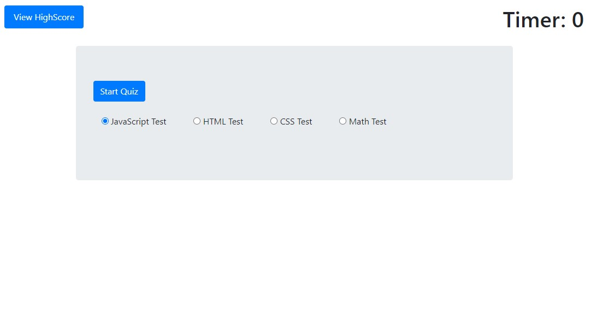
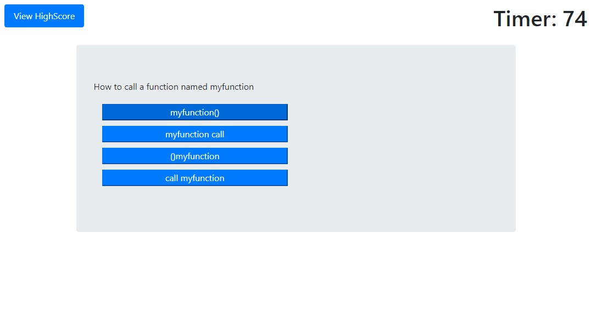
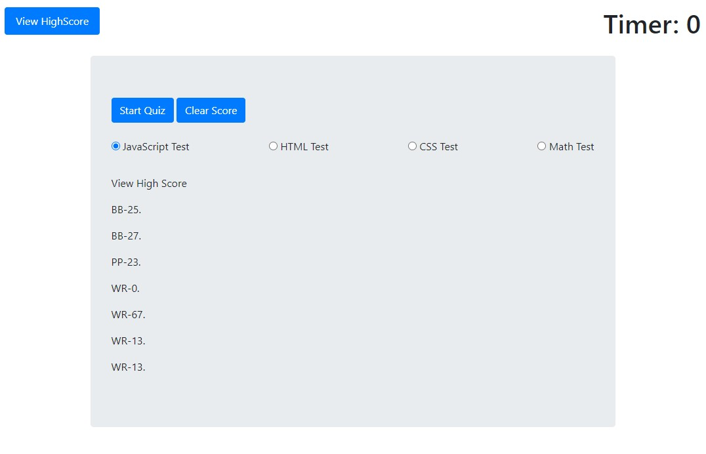

# 4-Code-Quiz:

This is a practice Code Quiz function for Bootcamp Student.

# Opening the page:

The user will arrive at the landing page and can choose between four quizzs.  Each test will have 5 questions with 4 multiple choice answers.  There is navigation a option to "View Highscores" and the "Time" value set at 0.  All the pages adapts to multiple screen sizes.

# Start Game:

After the user chooses the test and clicks on the "Start Quiz."  The page will provide a question and 4 multiple choice answers. All the questions and answers will appear at random orders.  If the user answers correctly, a positive sound will occur.  If the user answers incorrectly, a negative sound will occur. There will also be an "Correct" or "Incorrect" text appear at the bottom after each question.  That text will disappear after half a second.

# Timer:

The "Time" will start at 75 seconds and count down until it reaches 0.  The game will end at 0 seconds.  Each incorrect answer will subtract 15 seconds from the timer.  The timer will never show a negative amount.  When the timer reaches 0 and/or all questions are answered the game is automatically over. 

# View HighScore Button:

The user may click view HighScore at any time. After clicking, a "Clear Score" button and all the High Scores from previous games will appear.  All scores will be storage in localStorage function. The "Clear Score" button will clear history of previous scores. Please note clicking the on "view HighScore" button during a game will result in losing the game and will not be saved. 

# After the Game:

After 5 questions have been answered.  The page will show the player's time and ask to enter his/her initials below.  The user can only submit two letters.  Otherwise, cannot submit their name to the High Score Board.  After submit, the page will show all the High Score from the local storage.  

# The URL of the deployed application:

https://wilsonruan.github.io/4-Code-Quiz/

# The URL of the GitHub repository:

https://github.com/Wilsonruan/4-Code-Quiz